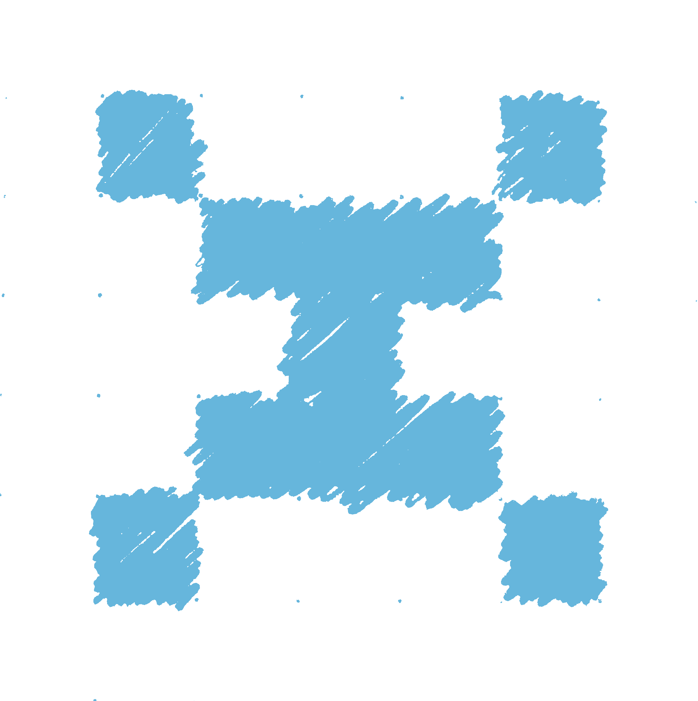

```
    ▀██        ▀██                                               
  ▄▄ ██         ██ ▄▄▄  ▄▄▄ ▄▄   ▄▄▄▄   ▄▄ ▄▄▄     ▄▄▄▄    ▄▄▄   
▄▀  ▀██         ██▀  ██  ██▀ ▀▀ ▀▀ ▄██   ██  ██  ▄█   ▀▀ ▄█  ▀█▄ 
█▄   ██   ████  ██    █  ██     ▄█▀ ██   ██  ██  ██      ██   ██ 
▀█▄▄▀██▄        ▀█▄▄▄▀  ▄██▄    ▀█▄▄▀█▀ ▄██▄ ██▄  ▀█▄▄▄▀  ▀█▄▄█▀
```

<p>
Hi, <br>
I'm a software developer with a focus on C and C++ programming languages.<br>
 </a> <a href="https://isocpp.org/" target="_blank" rel="noreferrer"> </a>
</p>
<br>
